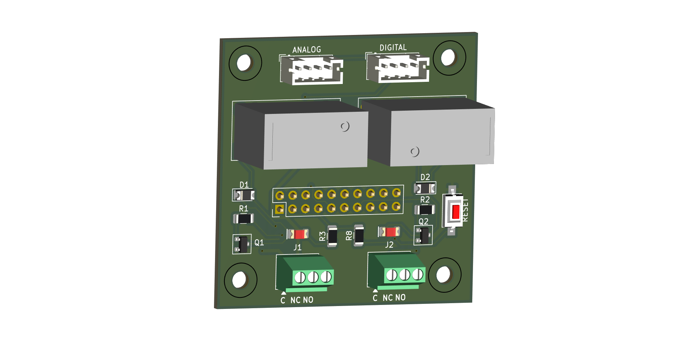
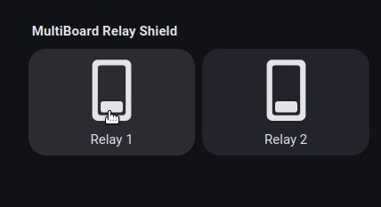
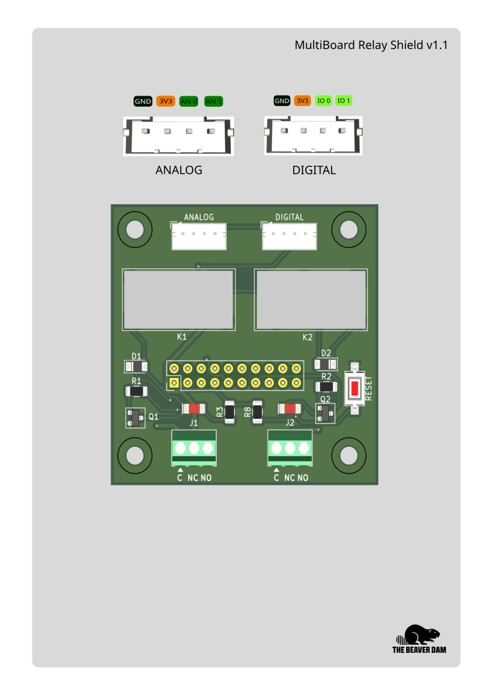
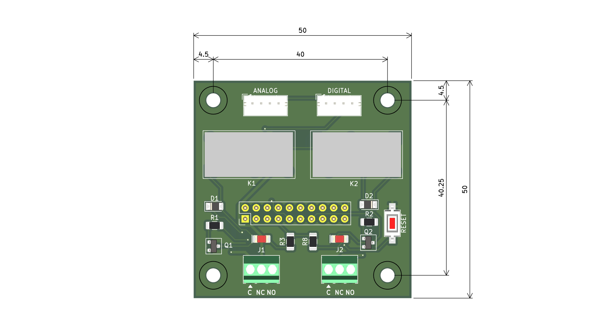

# ESP32 MultiBoard




The MultiBoard Relay Shield allows you to expand the ESP32 multiboard with two 10A relays and two grove connectors to use different sensors and actuators. 

It uses the this pins from the ESP32 Multiboard:


| Component | GPIO |
| :--- | :---: | 
| **Relay 1** | 32 |
| **Relay 2** | 33 |
| **IO 0** | 25 |
| **IO 1** | 26 |
| **AN 0** | 34 |
| **AN 1** | 35 |

-----

<br>

### ESPHome example
```yaml
switch:
  - platform: gpio
    name: "Relay 1"
    pin: 32
    id: relay_1
    restore_mode: ALWAYS_OFF

  - platform: gpio
    name: "Relay 2"
    pin: 33
    id: relay_2
    restore_mode: ALWAYS_OFF

```



<br>

---
<br>

## Pinout



---
<br>

## 🧩 Specifications

- **Power Supply:** Through the header pin
- **Relay:** Two 10A SPDT Relay with led indicator
- **Grove Connectors:**
  - Analog type
  - Digital type

---
<br>



---